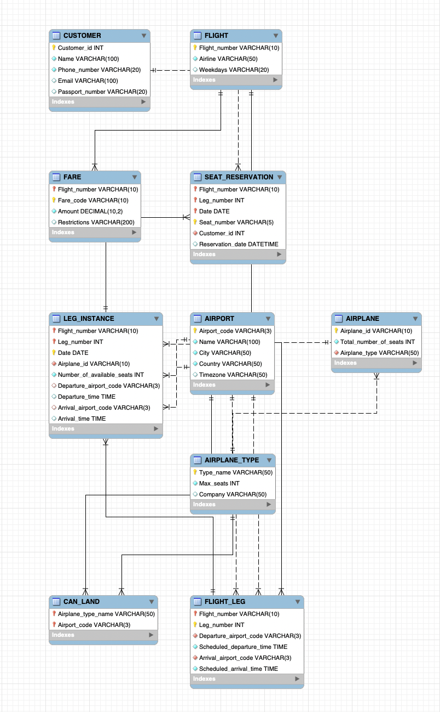
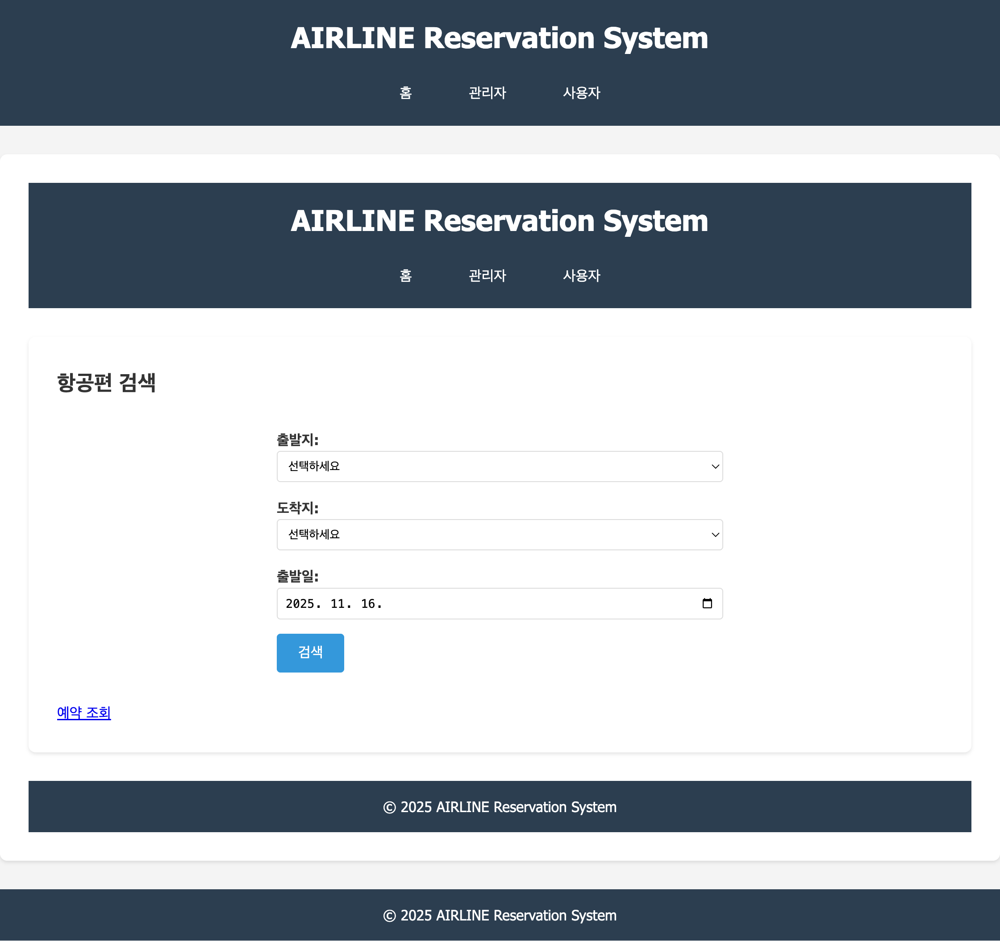
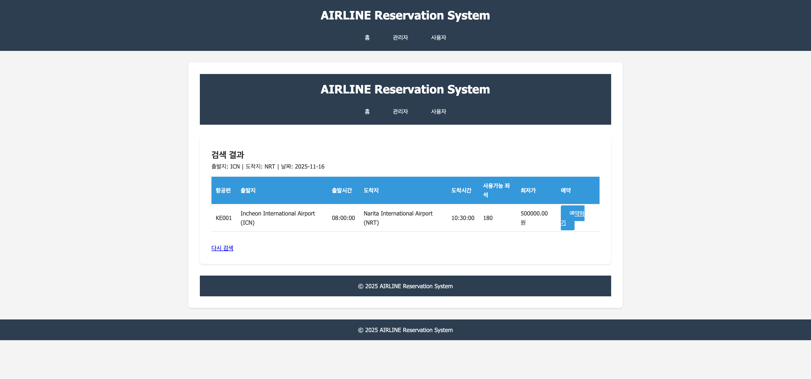
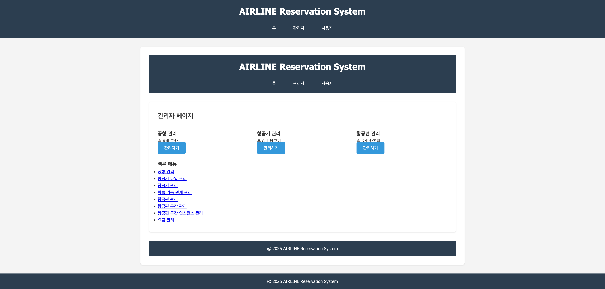
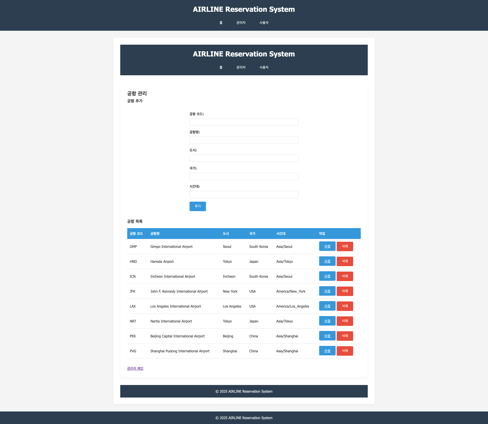
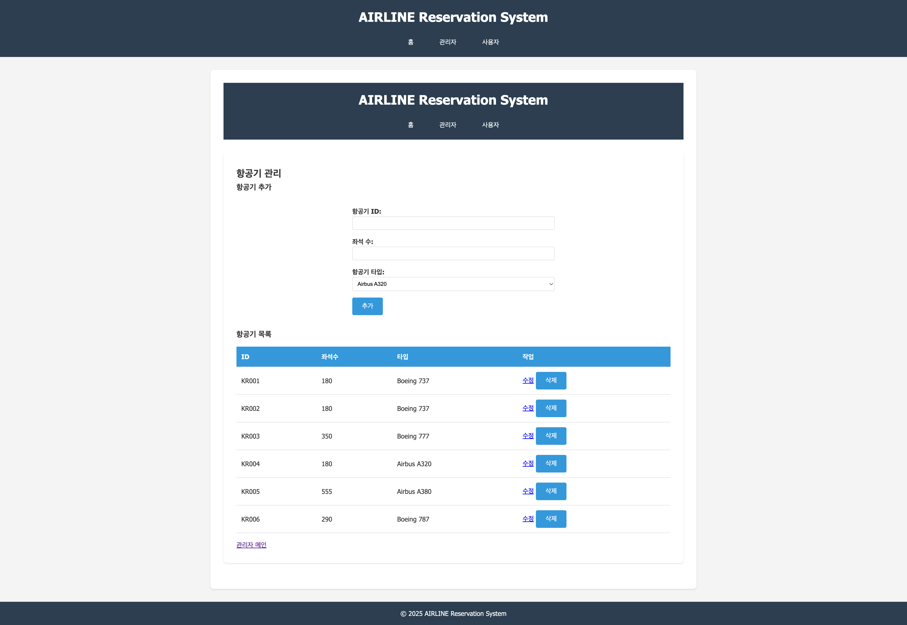
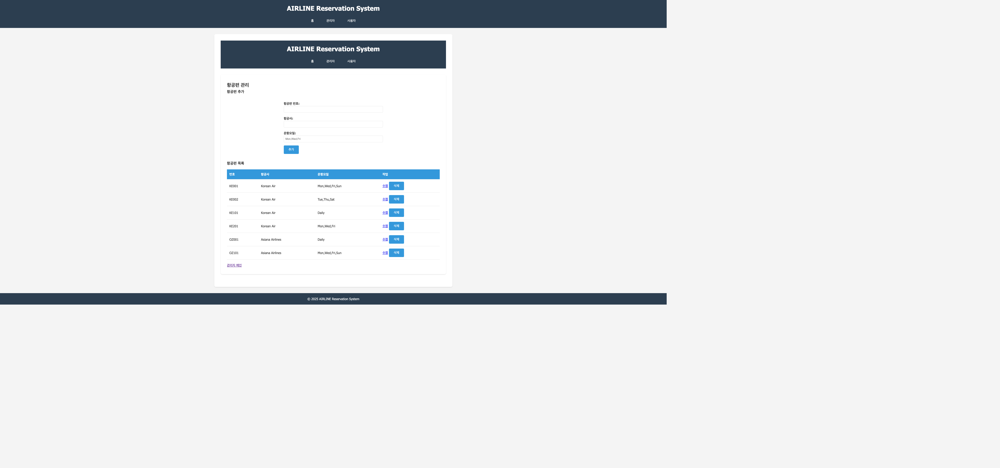
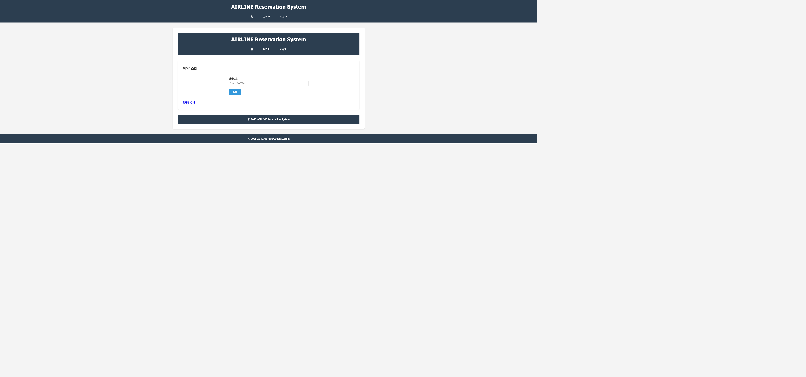

# AIRLINE 데이터베이스 구현 및 Web 응용 - 최종 프로젝트 보고서

**작성자**: kimmireu  
**과목**: 데이터베이스 설계 (EEC4408)  
**제출일**: 2025년 11월

---

## 1. 개요

### 1.1 프로젝트 목표

이번 프로젝트는 AIRLINE 데이터베이스를 기반으로 항공기 예약 시스템을 설계하고 구현하는 것이었음. 기본적인 요구사항에 따라 FLIGHT, FLIGHT_LEG, LEG_INSTANCE, FARE, SEAT_RESERVATION, AIRPLANE, AIRPLANE_TYPE, CAN_LAND, AIRPORT 등의 엔티티를 설계하고, 관리자 페이지와 사용자 페이지를 구현했음.

### 1.2 구현 기능

**관리자 페이지**:
- 공항 정보 입력/수정/삭제
- 항공기 정보 입력/수정/삭제
- 항공편 정보 입력/수정/삭제

**사용자 페이지**:
- 예약하기 기능 (트랜잭션 포함)
- 예약조회 기능
- 예약취소 기능 (트랜잭션 포함)

### 1.3 기술 스택

- **Backend**: Node.js, Express.js
- **Database**: MySQL
- **Template Engine**: Handlebars (hbs)
- **Session Management**: express-session
- **Database Driver**: mysql2

---

## 2. 상세 설계 내용

### 2.1 데이터베이스 스키마 설계

#### 2.1.1 ERD 설계

**EER Diagram**: 

MySQL Workbench에서 작성한 EER diagram은 아래와 같음. MySQL Workbench의 Reverse Engineer 기능을 사용하여 AIRLINE 데이터베이스의 모든 테이블과 관계를 자동으로 생성했음.



위 EER diagram은 MySQL Workbench에서 `Database` > `Reverse Engineer` 기능을 사용하여 생성했음. AIRLINE 데이터베이스의 모든 테이블과 외래키 관계가 시각적으로 표현되어 있으며, 각 테이블의 Primary Key와 Foreign Key 관계가 명확히 표시되어 있음.

**엔티티 관계 요약**:
- AIRPORT ↔ FLIGHT_LEG (1:N, 출발지/도착지)
- AIRPORT ↔ LEG_INSTANCE (1:N, 출발지/도착지)
- AIRPORT ↔ AIRPLANE_TYPE (N:M, CAN_LAND를 통한 착륙 가능 관계)
- AIRPLANE_TYPE → AIRPLANE (1:N)
- AIRPLANE → LEG_INSTANCE (1:N)
- FLIGHT → FLIGHT_LEG (1:N)
- FLIGHT → FARE (1:N)
- FLIGHT_LEG → LEG_INSTANCE (1:N)
- LEG_INSTANCE → SEAT_RESERVATION (1:N)
- CUSTOMER → SEAT_RESERVATION (1:N)

데이터베이스는 다음과 같은 엔티티들로 구성되었음:

1. **AIRPORT**: 공항 정보 (Airport_code, Name, City, Country, Timezone)
2. **AIRPLANE_TYPE**: 항공기 타입 정보 (Type_name, Max_seats, Company)
3. **AIRPLANE**: 항공기 정보 (Airplane_id, Total_number_of_seats, Airplane_type)
4. **CAN_LAND**: 항공기 타입과 공항 간 착륙 가능 관계
5. **FLIGHT**: 항공편 정보 (Flight_number, Airline, Weekdays)
6. **FLIGHT_LEG**: 항공편 구간 정보 (Flight_number, Leg_number, Departure_airport_code, Scheduled_departure_time, Arrival_airport_code, Scheduled_arrival_time)
7. **LEG_INSTANCE**: 항공편 구간 인스턴스 (날짜별) (Flight_number, Leg_number, Date, Airplane_id, Number_of_available_seats, ...)
8. **FARE**: 요금 정보 (Flight_number, Fare_code, Amount, Restrictions)
9. **CUSTOMER**: 고객 정보 (Customer_id, Name, Phone_number, Email, Passport_number)
10. **SEAT_RESERVATION**: 좌석 예약 정보 (Flight_number, Leg_number, Date, Seat_number, Customer_id, Reservation_date)

#### 2.1.2 정규화

모든 테이블은 3NF(제3정규형)까지 정규화되었음:

- **1NF**: 모든 속성이 원자값을 가짐
- **2NF**: 부분 함수 종속성 제거 (FLIGHT_LEG의 복합키, LEG_INSTANCE의 복합키 등)
- **3NF**: 이행 함수 종속성 제거 (AIRPLANE의 Airplane_type을 별도 테이블로 분리)

#### 2.1.3 제약조건

**Primary Key 제약조건**:
- 각 테이블에 적절한 Primary Key 설정
- 복합키 사용 (FLIGHT_LEG, LEG_INSTANCE, SEAT_RESERVATION 등)

**Foreign Key 제약조건**:
- 참조 무결성 보장
- ON DELETE CASCADE / ON DELETE RESTRICT 적절히 사용
- ON UPDATE CASCADE 사용

**CHECK 제약조건**:
- Leg_number > 0
- Max_seats > 0
- Total_number_of_seats > 0
- Number_of_available_seats >= 0
- Amount >= 0

**트리거를 통한 제약조건**:
- 출발지와 도착지가 같을 수 없도록 검증 (FLIGHT_LEG)
- LEG_INSTANCE 삽입 시 좌석 수 자동 설정

**애플리케이션 레벨 제약조건**:
- FLIGHT_LEG 존재 여부 확인
- AIRPLANE 존재 여부 확인
- CAN_LAND 관계 확인 (항공기 타입이 도착 공항에 착륙 가능한지)
- AIRPORT 존재 여부 확인
- 좌석 수 일치 확인

#### 2.1.4 인덱스 설계

성능 최적화를 위해 다음과 같은 인덱스를 생성했음:

```sql
-- 기본 인덱스
CREATE INDEX idx_city ON AIRPORT(City);
CREATE INDEX idx_airplane_type ON AIRPLANE(Airplane_type);
CREATE INDEX idx_departure_airport ON FLIGHT_LEG(Departure_airport_code);
CREATE INDEX idx_arrival_airport ON FLIGHT_LEG(Arrival_airport_code);
CREATE INDEX idx_date ON LEG_INSTANCE(Date);
CREATE INDEX idx_airplane ON LEG_INSTANCE(Airplane_id);
CREATE INDEX idx_name ON CUSTOMER(Name);
CREATE INDEX idx_customer ON SEAT_RESERVATION(Customer_id);
CREATE INDEX idx_reservation_date ON SEAT_RESERVATION(Reservation_date);

-- 복합 인덱스
CREATE INDEX idx_flight_leg_composite ON FLIGHT_LEG(Flight_number, Leg_number);
CREATE INDEX idx_leg_instance_date_range ON LEG_INSTANCE(Date, Flight_number);
CREATE INDEX idx_seat_reservation_customer_date ON SEAT_RESERVATION(Customer_id, Date);
```

#### 2.1.5 뷰 생성

복잡한 조인 쿼리를 뷰로 생성하여 재사용성을 높였음:

1. **vw_flight_details**: 항공편 상세 정보 (FLIGHT + FLIGHT_LEG + AIRPORT 정보)
2. **vw_available_flights**: 예약 가능한 항공편 조회 (LEG_INSTANCE + FLIGHT_LEG + AIRPLANE + AIRPORT 정보)
3. **vw_customer_reservations**: 고객 예약 정보 (SEAT_RESERVATION + CUSTOMER + FLIGHT_LEG + FLIGHT + AIRPORT 정보)

#### 2.1.6 트랜잭션 설계

**예약하기 트랜잭션**:
```javascript
// setSeatReservation 함수에서 구현
await connection.beginTransaction();
// 1. 좌석 예약 삽입
INSERT INTO SEAT_RESERVATION ...
// 2. 사용 가능한 좌석 수 감소
UPDATE LEG_INSTANCE SET Number_of_available_seats = Number_of_available_seats - 1 ...
await connection.commit();
// 에러 발생 시 rollback
```

**예약 취소 트랜잭션**:
```javascript
// deleteSeatReservation 함수에서 구현
await connection.beginTransaction();
// 1. 좌석 예약 삭제
DELETE FROM SEAT_RESERVATION ...
// 2. 사용 가능한 좌석 수 증가
UPDATE LEG_INSTANCE SET Number_of_available_seats = Number_of_available_seats + 1 ...
await connection.commit();
// 에러 발생 시 rollback
```

### 2.2 애플리케이션 설계

#### 2.2.1 프로젝트 구조

```
final_project/
├── database/
│   └── sql.js              # 데이터베이스 연결 및 SQL 쿼리 함수
├── routes/
│   ├── admin.js           # 관리자 페이지 라우터
│   └── user.js            # 사용자 페이지 라우터
├── views/
│   ├── admin/             # 관리자 페이지 뷰
│   └── user/               # 사용자 페이지 뷰
├── public/
│   └── css/
│       └── style.css       # 스타일시트
├── src/
│   └── index.js           # Express 서버 메인 파일
└── database/
    └── create_database.sql # 데이터베이스 생성 스크립트
```

#### 2.2.2 주요 구현 내용

**데이터베이스 연결** (`database/sql.js`):
```javascript
const pool = mysql.createPool({
    host: 'localhost',
    port: 3306,
    user: 'dbuser',
    password: 'c3409711!',
    database: 'AIRLINE',
    charset: 'utf8mb4',
    collation: 'utf8mb4_unicode_ci',
    connectionLimit: 10,
    acquireTimeout: 60000,
    timeout: 60000,
});
```

**트랜잭션 구현** (`database/sql.js` - setSeatReservation):
```javascript
setSeatReservation: async (data) => {
    const connection = await promisePool.getConnection();
    try {
        await connection.beginTransaction();
        
        // 좌석 예약 삽입
        const sql1 = `INSERT INTO SEAT_RESERVATION 
                     (Flight_number, Leg_number, Date, Seat_number, Customer_id) 
                     VALUES (?, ?, ?, ?, ?)`;
        await connection.query(sql1, [
            data.Flight_number,
            data.Leg_number,
            data.Date,
            data.Seat_number,
            data.Customer_id
        ]);
        
        // 사용 가능한 좌석 수 감소
        const sql2 = `UPDATE LEG_INSTANCE 
                     SET Number_of_available_seats = Number_of_available_seats - 1 
                     WHERE Flight_number = ? AND Leg_number = ? AND Date = ?`;
        await connection.query(sql2, [
            data.Flight_number,
            data.Leg_number,
            data.Date
        ]);
        
        await connection.commit();
    } catch (error) {
        await connection.rollback();
        throw error;
    } finally {
        connection.release();
    }
}
```

**제약조건 검증** (`database/sql.js` - validateLegInstance):
```javascript
validateLegInstance: async (data) => {
    const errors = [];
    
    // FLIGHT_LEG 존재 확인
    const flightLegExists = await validationSql.checkFlightLegExists(
        data.Flight_number, data.Leg_number
    );
    if (!flightLegExists) {
        errors.push('FLIGHT_LEG does not exist');
    }
    
    // AIRPLANE 존재 확인
    const airplaneExists = await validationSql.checkAirplaneExists(data.Airplane_id);
    if (!airplaneExists) {
        errors.push('AIRPLANE does not exist');
    }
    
    // CAN_LAND 관계 확인
    const canLand = await validationSql.checkCanLandRelation(
        data.Airplane_id, data.Arrival_airport_code
    );
    if (!canLand) {
        errors.push('Airplane type cannot land at arrival airport');
    }
    
    return {
        valid: errors.length === 0,
        errors: errors
    };
}
```

**라우팅 구조**:
- `/admin`: 관리자 메인 페이지
- `/admin/airport`: 공항 관리
- `/admin/airplane`: 항공기 관리
- `/admin/flight`: 항공편 관리
- `/user`: 사용자 메인 페이지 (항공편 검색)
- `/user/search`: 검색 결과
- `/user/reserve/:flightNumber/:legNumber/:date`: 예약하기
- `/user/reservation`: 예약 조회
- `/user/cancel`: 예약 취소

---

## 3. 실행 화면

### 3.1 사용자 페이지

#### 3.1.1 항공편 검색 화면



항공편 검색을 위한 출발지, 도착지, 출발일을 선택할 수 있는 화면임.

#### 3.1.2 검색 결과 화면



검색 조건에 맞는 항공편 목록이 표시되고, 각 항공편에 대해 예약하기 버튼이 제공됨.

### 3.2 관리자 페이지

#### 3.2.1 관리자 메인 화면



관리자 페이지의 메인 화면으로, 공항, 항공기, 항공편의 개수를 표시하고 각 관리 메뉴로 이동할 수 있음.

#### 3.2.2 공항 관리 화면



공항 정보를 추가, 수정, 삭제할 수 있는 화면임. 공항 목록이 테이블 형태로 표시되고, 각 공항에 대해 수정/삭제 버튼이 제공됨.

#### 3.2.3 항공기 관리 화면



항공기 정보를 추가, 수정, 삭제할 수 있는 화면임. 항공기 목록이 테이블 형태로 표시되고, 항공기 타입을 선택하여 항공기를 추가할 수 있음.

#### 3.2.4 항공편 관리 화면



항공편 정보를 추가, 수정, 삭제할 수 있는 화면임. 항공편 목록이 테이블 형태로 표시되고, 각 항공편에 대해 수정/삭제 버튼이 제공됨.

### 3.3 사용자 페이지 (예약 기능)

#### 3.3.1 예약하기 화면


항공편을 선택한 후 좌석과 고객 정보를 입력하여 예약할 수 있는 화면임.

#### 3.3.2 예약 조회 화면



전화번호를 입력하여 예약 정보를 조회할 수 있는 화면임.

#### 3.3.3 예약 목록 화면


조회한 고객의 예약 목록을 확인할 수 있는 화면임. 각 예약에 대해 취소 버튼이 제공됨.

---

## 4. 고찰

### 4.1 구현 성공 사항

1. **데이터베이스 설계**: 요구사항에 맞는 모든 엔티티와 관계를 설계하고, 정규화를 통해 데이터 중복을 최소화했음.

2. **제약조건 구현**: Primary Key, Foreign Key, CHECK 제약조건, 트리거, 애플리케이션 레벨 검증을 통해 데이터 무결성을 보장했음.

3. **성능 최적화**: 자주 조회되는 컬럼에 인덱스를 생성하고, 복합 인덱스를 통해 쿼리 성능을 향상시켰음.

4. **뷰 활용**: 복잡한 조인 쿼리를 뷰로 생성하여 코드 재사용성을 높이고 유지보수를 용이하게 했음.

5. **트랜잭션 구현**: 예약하기와 예약 취소 기능에서 트랜잭션을 사용하여 데이터 일관성을 보장했음.

6. **사용자 인터페이스**: 관리자와 사용자 페이지를 분리하여 각각의 역할에 맞는 인터페이스를 제공했음.

### 4.2 개선 가능한 사항

1. **에러 처리**: 더 상세한 에러 메시지와 로깅 시스템을 추가하면 디버깅이 더 쉬워질 것임.

2. **보안**: 관리자 페이지에 인증/인가 기능을 추가하면 보안이 강화될 것임.

3. **사용자 경험**: 좌석 선택을 시각적으로 표현하거나, 예약 확인 이메일 발송 기능을 추가하면 사용자 경험이 향상될 것임.

4. **성능**: 대량의 데이터를 처리할 때를 대비한 페이징 기능이나 캐싱 전략을 추가하면 좋을 것임.

5. **테스트**: 단위 테스트와 통합 테스트를 추가하면 코드의 안정성이 향상될 것임.

### 4.3 학습한 내용

이번 프로젝트를 통해 데이터베이스 설계부터 웹 애플리케이션 구현까지의 전체 과정을 경험할 수 있었음. 특히 제약조건, 인덱스, 뷰, 트랜잭션 등의 개념을 실제로 구현하면서 이론과 실무를 연결할 수 있었음. 또한 Node.js와 Express.js를 사용한 서버 사이드 개발 경험도 쌓을 수 있었음.

---

## 5. 결론

AIRLINE 데이터베이스를 기반으로 한 항공기 예약 시스템을 성공적으로 구현했음. 요구사항에 명시된 모든 기능을 구현했고, 제약조건, 정규화, 인덱스, 뷰, 트랜잭션 등을 적절히 활용하여 안정적이고 효율적인 시스템을 구축했음. 이번 프로젝트를 통해 데이터베이스 설계와 웹 애플리케이션 개발에 대한 전반적인 이해를 높일 수 있었음.

---

## 부록

### A. EER Diagram

EER Diagram은 MySQL Workbench의 Reverse Engineer 기능을 사용하여 생성했음. `screenshots/10_eer_diagram.png` 파일로 제공됨.

MySQL Workbench에서 EER diagram을 생성하는 방법:
1. MySQL Workbench 실행
2. `Database` > `Reverse Engineer...` 메뉴 선택
3. AIRLINE 데이터베이스에 연결
4. 모든 테이블 선택 후 EER Diagram 생성

### B. 데이터베이스 생성 스크립트

전체 데이터베이스 생성 스크립트는 `database/create_database.sql` 파일에 포함되어 있음.

이 스크립트에는 다음이 포함되어 있음:
- CREATE TABLE 문 (모든 테이블)
- PRIMARY KEY, FOREIGN KEY 제약조건
- CHECK 제약조건
- CREATE INDEX 문 (성능 최적화)
- CREATE VIEW 문 (3개 뷰)
- 트리거 (좌석 수 자동 설정, 공항 검증)
- 샘플 데이터 INSERT 문

### C. 주요 파일 목록

- `database/create_database.sql`: 데이터베이스 스키마 및 샘플 데이터
- `database/sql.js`: 데이터베이스 연결 및 쿼리 함수
- `routes/admin.js`: 관리자 페이지 라우터
- `routes/user.js`: 사용자 페이지 라우터
- `src/index.js`: Express 서버 메인 파일
- `views/admin/`: 관리자 페이지 뷰 파일들
- `views/user/`: 사용자 페이지 뷰 파일들

