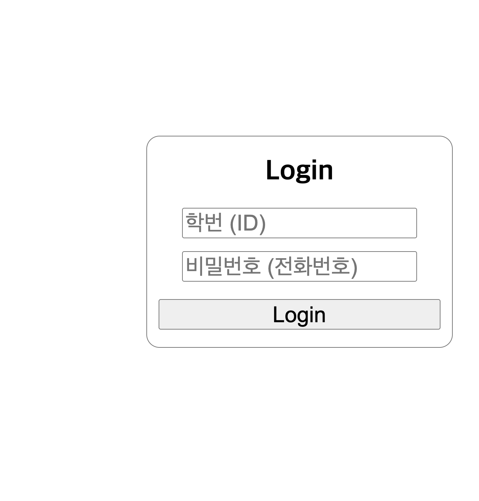
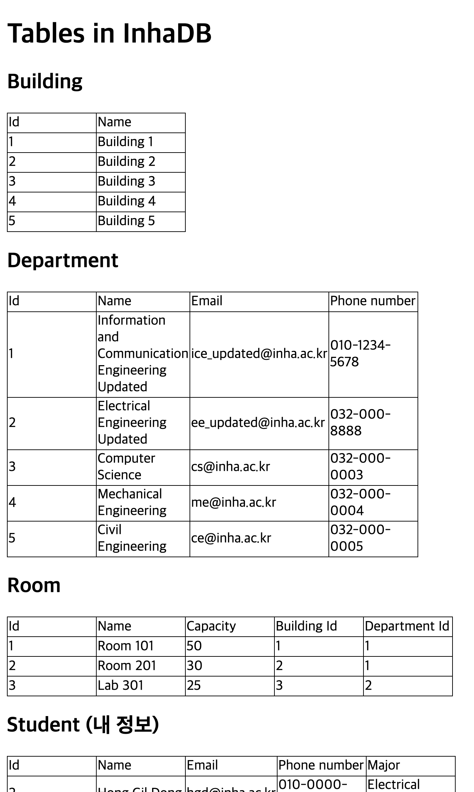
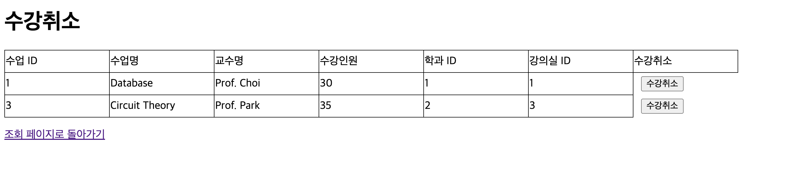
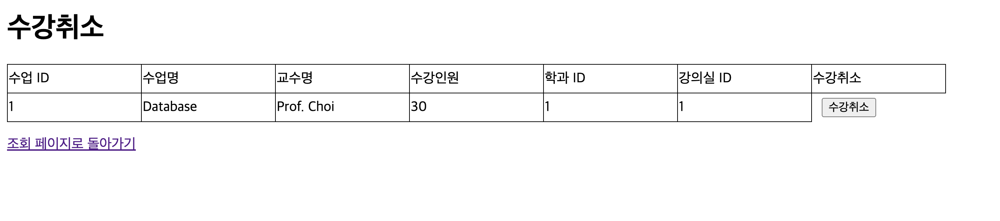
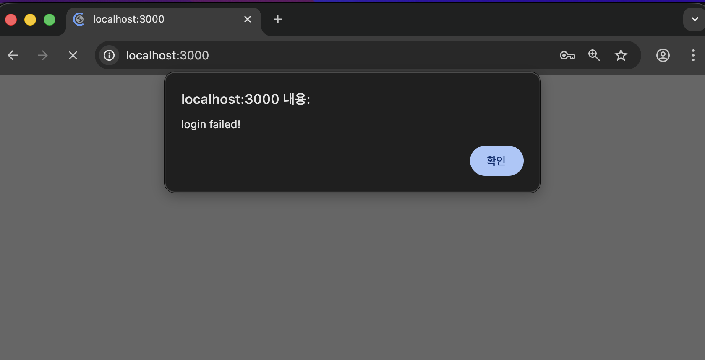

# 데이터베이스 설계 10주차 과제 보고서

---

## 보고서 작성 서약서

**나는 보고서 작성시 윤리에 어긋난 행동을 하지 않고 정보통신공학인으로서 나의 명예를 지킬 것을 맹세합니다.**

---

## 1. 개요

### 1.1 과제 목표
7주차에서 구현한 Inha DB 웹 애플리케이션에 로그인 기능과 수강취소 기능을 추가하는 것입니다. 학생의 학번과 전화번호를 이용한 로그인 시스템을 구현하고, 로그인한 학생만 자신의 정보를 조회하고 수강 중인 수업을 수강취소할 수 있도록 권한 관리를 적용했습니다.

### 1.2 구현 요구사항
- **STEP 1**: 7주차 Inha DB 웹에 로그인 기능 적용
  - 학생의 학번(Id) 및 비밀번호(전화번호, Phone_number)로 로그인
  - 로그인 성공 시 학생 정보 조회 페이지로 이동
  - 로그인 실패 시 경고 창 팝업
  
- **STEP 2**: 수강취소 기능 구현
  - `localhost:3000/delete/class` 페이지 생성
  - 학생으로 로그인한 경우에만 접근 가능
  - 수강하는 수업(class)을 수강취소(삭제)할 수 있는 기능

### 1.3 사용 기술
- **백엔드**: Node.js, Express.js
- **데이터베이스**: MySQL (InhaDB)
- **템플릿 엔진**: Handlebars (hbs)
- **세션 관리**: express-session
- **데이터베이스 연결**: mysql2

---

## 2. 상세 설계 내용

### 2.1 데이터베이스 구조 확장

#### 2.1.1 Enrollment 테이블 생성
학생과 수업 간의 관계를 나타내기 위해 `Enrollment` 테이블을 생성했습니다.

```sql
CREATE TABLE IF NOT EXISTS Enrollment (
    Student_Id INT,
    Class_Id INT,
    PRIMARY KEY (Student_Id, Class_Id),
    FOREIGN KEY (Student_Id) REFERENCES Student(Id) ON DELETE CASCADE,
    FOREIGN KEY (Class_Id) REFERENCES Class(Id) ON DELETE CASCADE
);
```

**설계 사고 과정**: 
- Student와 Class 테이블은 이미 존재했지만, 학생이 어떤 수업을 수강하는지 나타내는 관계 테이블이 없었습니다.
- 다대다 관계를 표현하기 위해 Enrollment 테이블을 생성하여 Student_Id와 Class_Id를 외래키로 사용했습니다.
- CASCADE 옵션을 사용하여 학생이나 수업이 삭제될 때 관련 수강 정보도 자동으로 삭제되도록 설계했습니다.

### 2.2 로그인 기능 구현 (STEP 1)

#### 2.2.1 로그인 라우터 구현
`routes/login.js` 파일을 생성하여 로그인 기능을 구현했습니다.

**핵심 코드**:
```javascript
router.post('/', async (req, res) => {
    const vars = req.body;
    
    try {
        const student = await selectSql.getStudentByLogin(vars.id, vars.password);
        
        if (student) {
            req.session.user = { 
                id: student.Id, 
                role: 'student', 
                checkLogin: true 
            };
            res.redirect('/select');
        } else {
            res.send(`<script>
                        alert('login failed!');
                        location.href='/';
                    </script>`);
        }
    } catch (error) {
        console.error('Login error:', error);
        res.send(`<script>
                    alert('로그인 중 오류가 발생했습니다.');
                    location.href='/';
                </script>`);
    }
});
```

**알고리즘 동작 과정**:
1. 사용자가 로그인 폼에서 학번과 비밀번호(전화번호)를 입력합니다.
2. POST 요청이 들어오면 `getStudentByLogin()` 함수를 호출하여 Student 테이블에서 해당 학번과 전화번호가 일치하는 학생을 조회합니다.
3. 학생 정보가 존재하면 세션에 사용자 정보를 저장합니다.
4. 로그인 성공 시 `/select` 페이지로 리다이렉트합니다.
5. 학생 정보가 없으면 경고 창을 띄우고 로그인 페이지로 다시 이동합니다.

**구현 방식과 사고 과정**:
- Student 테이블의 Id와 Phone_number를 직접 사용하여 로그인을 구현했습니다.
- 세션을 사용하여 로그인 상태를 유지하고, 이후 페이지에서 권한을 체크할 수 있도록 설계했습니다.
- 에러 처리를 위해 try-catch 블록을 사용하여 예외 상황을 처리했습니다.

#### 2.2.2 데이터베이스 쿼리 함수 추가
`database/sql.js`에 로그인 관련 쿼리 함수를 추가했습니다.

```javascript
getStudentByLogin: async (id, phoneNumber) => {
    const sql = `select * from Student where Id = ${id} and Phone_number = "${phoneNumber}"`;
    const [result] = await promisePool.query(sql);
    return result[0];
},
```

#### 2.2.3 학생 정보 조회 페이지 수정
`routes/select.js`를 수정하여 로그인한 학생의 정보만 조회하도록 변경했습니다.

**핵심 코드**:
```javascript
router.get('/', async (req, res) => {
    if (!req.session.user || !req.session.user.checkLogin) {
        return res.redirect('/');
    }

    const studentId = req.session.user.id;
    const Student = await selectSql.getStudentById(studentId);
    
    const Building = await selectSql.getBuilding();
    const Department = await selectSql.getDepartment();
    const Room = await selectSql.getRoom();
    const Class = await selectSql.getClass();

    const StudentArray = Student ? [Student] : [];

    res.render('select', {
        main_title: "Tables in InhaDB",
        title4: "Student (내 정보)",
        Student: StudentArray,
        // ... 기타 테이블 정보
    })
})
```

### 2.3 수강취소 기능 구현 (STEP 2)

#### 2.3.1 수강취소 라우터 구현
`routes/delete.js` 파일을 생성하여 수강취소 기능을 구현했습니다.

**핵심 코드**:
```javascript
router.get('/class', async (req, res) => {
    if (!req.session.user || !req.session.user.checkLogin || req.session.user.role !== 'student') {
        return res.redirect('/');
    }

    try {
        const studentId = req.session.user.id;
        const enrolledClasses = await selectSql.getEnrolledClasses(studentId);
        
        res.render('deleteClass', {
            title: "수강취소",
            classes: enrolledClasses,
        });
    } catch (error) {
        console.error('Error fetching enrolled classes:', error);
        res.send(`<script>
                    alert('수강 정보를 불러오는 중 오류가 발생했습니다.');
                    location.href='/select';
                </script>`);
    }
});

router.post('/class', async (req, res) => {
    if (!req.session.user || !req.session.user.checkLogin || req.session.user.role !== 'student') {
        return res.redirect('/');
    }

    try {
        const studentId = req.session.user.id;
        const classId = req.body.classId;
        
        await deleteSql.deleteEnrollment(studentId, classId);
        
        res.redirect('/delete/class');
    } catch (error) {
        console.error('Error deleting enrollment:', error);
        res.send(`<script>
                    alert('수강취소 중 오류가 발생했습니다.');
                    location.href='/delete/class';
                </script>`);
    }
});
```

**알고리즘 동작 과정**:
1. GET `/delete/class`: 세션에서 로그인 정보와 학생 권한을 확인하고, 수강 중인 수업 목록을 조회하여 화면에 표시합니다.
2. POST `/delete/class`: 권한을 확인한 후 Enrollment 테이블에서 해당 레코드를 삭제하고, 수강취소 페이지로 다시 리다이렉트합니다.

#### 2.3.2 데이터베이스 쿼리 함수 추가
수강 수업 조회 및 삭제를 위한 쿼리 함수를 추가했습니다.

```javascript
getEnrolledClasses: async (studentId) => {
    const sql = `
        select c.Id, c.Name, c.Professor, c.Number_of_participants
        from Class c
        inner join Enrollment e on c.Id = e.Class_Id
        where e.Student_Id = ${studentId}
    `;
    const [result] = await promisePool.query(sql);
    return result;
},

deleteEnrollment: async (studentId, classId) => {
    const sql = `delete from Enrollment where Student_Id = ${studentId} and Class_Id = ${classId}`;
    await promisePool.query(sql);
},
```

### 2.4 세션 관리 설정

`src/index.js`에 세션 미들웨어를 추가했습니다.

```javascript
import expressSession from 'express-session';

app.use(
    expressSession({
        secret: "my key",
        resave: true,
        saveUninitialized: true,
    })
);
```

---

## 3. 실행 화면

### 3.1 로그인 페이지


**설명**: 
- 초기 접속 시 표시되는 로그인 페이지입니다.
- 학번(ID)과 비밀번호(전화번호) 입력 필드가 있습니다.
- "Login" 버튼을 클릭하여 로그인을 진행합니다.

### 3.2 학생 정보 조회 페이지 (로그인 성공 후)


**설명**:
- 로그인 성공 후 자동으로 이동하는 페이지입니다.
- 로그인한 학생(학생 1번: LEE Sangwon)의 정보가 "Student (내 정보)" 섹션에 표시됩니다.
- Building, Department, Room, Class 테이블 정보도 함께 표시되어 전체 데이터베이스 구조를 확인할 수 있습니다.

### 3.3 수강취소 페이지 (삭제 전)


**설명**:
- `localhost:3000/delete/class` 경로로 접속한 화면입니다.
- 학생 1번이 수강하는 수업 2개가 표시됩니다:
  - Database Systems (Dr. Kim)
  - Thermodynamics (Dr. Lee)
- 각 수업마다 "수강취소" 버튼이 있어 클릭 시 해당 수업을 수강취소할 수 있습니다.

### 3.4 수강취소 페이지 (삭제 후)


**설명**:
- Database Systems 수업의 "수강취소" 버튼을 클릭한 후의 화면입니다.
- Database Systems 수업이 삭제되어 Thermodynamics 수업만 남아있습니다.
- 수강취소 기능이 정상적으로 작동하는 것을 확인할 수 있습니다.

### 3.5 로그인 실패 화면


**설명**:
- 잘못된 학번이나 비밀번호를 입력한 경우 "login failed!" 알림 창이 표시됩니다.
- 알림 창을 닫으면 다시 로그인 페이지로 돌아옵니다.

---

## 4. 결론

### 4.1 구현 결과
본 과제의 모든 요구사항을 성공적으로 구현했습니다.

**STEP 1: 로그인 기능**
- ✅ 학생의 학번과 전화번호로 로그인하는 기능 구현 완료
- ✅ 로그인 성공 시 학생 정보 조회 페이지로 이동
- ✅ 로그인 실패 시 경고 창 팝업 및 로그인 페이지로 복귀
- ✅ 세션을 통한 로그인 상태 유지

**STEP 2: 수강취소 기능**
- ✅ `localhost:3000/delete/class` 페이지 구현 완료
- ✅ 학생 권한 체크를 통한 접근 제어
- ✅ 수강 중인 수업 목록 조회 기능
- ✅ 수강취소(삭제) 기능 정상 작동

### 4.2 구현 과정에서의 주요 고려사항
1. **데이터베이스 설계**: Student와 Class 간의 관계를 나타내기 위해 Enrollment 테이블을 생성했습니다.
2. **보안**: 세션을 통한 권한 관리로 로그인하지 않은 사용자의 접근을 차단했습니다.
3. **사용자 경험**: 로그인 실패 시 명확한 피드백을 제공하고, 수강취소 후 즉시 업데이트된 목록을 표시했습니다.
4. **에러 처리**: try-catch 블록을 사용하여 예외 상황을 처리하고 사용자에게 알림을 제공했습니다.

### 4.3 최종 평가
본 과제를 통해 웹 애플리케이션에 로그인 기능과 권한 관리를 추가하는 방법을 학습했습니다. Express.js의 세션 관리 기능을 활용하여 사용자 인증과 권한 제어를 구현했으며, 데이터베이스 관계를 이해하고 Enrollment 테이블을 통해 학생과 수업 간의 관계를 표현했습니다. 모든 요구사항을 충족하는 완전한 기능을 구현했으며, 실제 테스트를 통해 정상 작동을 확인했습니다.

---

**보고서 작성일**: 2024년 11월 10일
