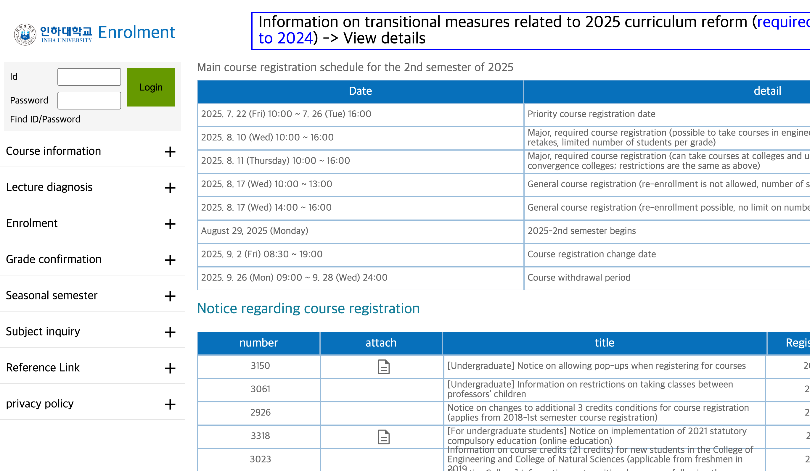
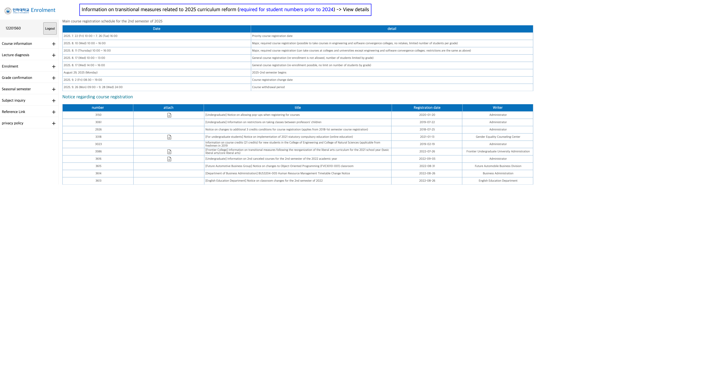
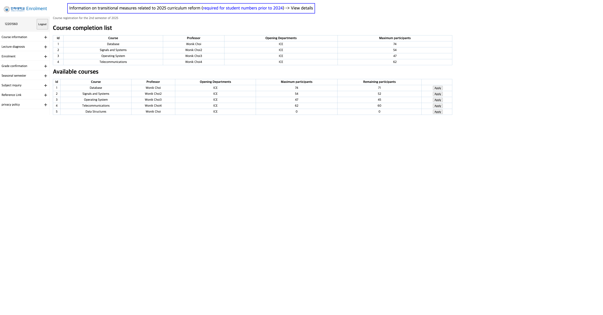
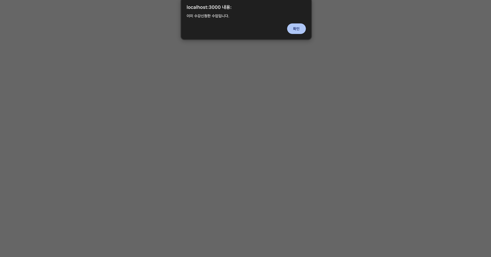
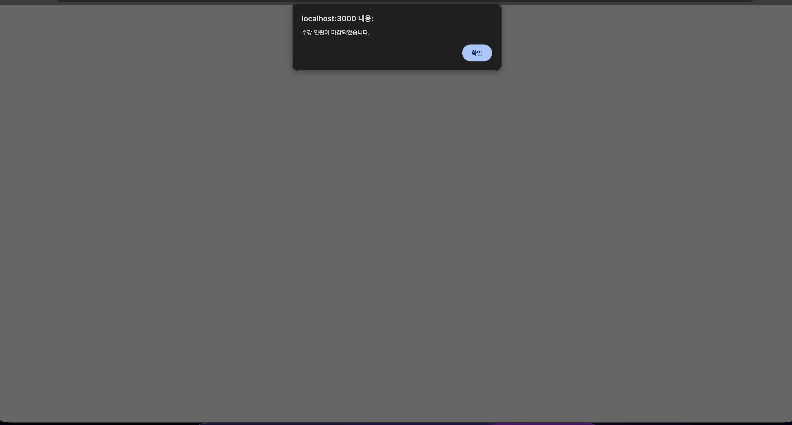

# 데이터베이스 설계 12주차 과제 보고서

---

## 보고서 작성 서약서

**나는 보고서 작성시 윤리에 어긋난 행동을 하지 않고 정보통신공학인으로서 나의 명예를 지킬 것을 맹세합니다.**

---

## 1. 개요

### 1.1 과제 목표
본 과제는 11주차에서 구현한 Inha DB 웹 애플리케이션에 수강신청 기능을 추가하는 것임. 로그인한 학생이 'Enrolment' 메뉴를 클릭하면 수강신청 페이지로 이동하고, Apply 버튼을 통해 수강신청을 할 수 있도록 구현했음. 또한 수강신청 시 제약 조건(이미 수강신청한 수업은 신청 불가, Remaining participants가 0이면 신청 불가)을 적용하여 데이터 무결성을 보장했음.

### 1.2 구현 요구사항
- **STEP 1**: 로그인 했을 경우에 'Enrolment'를 클릭하면 수강신청 페이지로 이동
  - 로그인한 학생의 학번을 쿠키로 저장하여 인증 상태 유지
  - Enrolment 메뉴 클릭 시 `/sugang` 경로로 이동하여 수강신청 페이지 표시
  
- **STEP 2**: Apply 버튼으로 수강신청 할 수 있는 기능 구현
  - Apply 버튼을 눌렀을 경우 DB에 학생이 수강신청한 내용이 반영되도록 업데이트
  - **제약 조건 1**: Remaining participants가 0이면 수강신청 안되야 함
  - **제약 조건 2**: Course completion list에 있는 수업은 수강신청 안되야 함

### 1.3 사용 기술
- **백엔드**: Node.js, Express.js
- **데이터베이스**: MySQL (WEEK11_INHA_DB)
- **템플릿 엔진**: Handlebars (hbs)
- **세션 관리**: express-session, cookie-parser
- **데이터베이스 연결**: mysql2 (Promise 기반)

---

## 2. 상세 설계 내용

### 2.1 데이터베이스 구조

#### 2.1.1 기존 테이블 구조 활용
week11에서 생성한 데이터베이스 구조를 그대로 사용했음:
- **Student**: 학생 정보 (StudentId, password 등)
- **Class**: 수업 정보 (ID, Name, Professor, Number_of_participant 등)
- **class_student**: 학생과 수업 간의 관계를 나타내는 테이블 (Student_Id, Class_Id)

**설계 사고 과정**: 
- class_student 테이블은 이미 존재했으므로 별도로 생성할 필요가 없었음.
- Student_Id는 Student 테이블의 내부 ID를 참조하고, Class_Id는 Class 테이블의 ID를 참조함.
- 이 구조를 활용하여 수강신청 기능을 구현했음.

### 2.2 수강신청 페이지 구현 (STEP 1)

#### 2.2.1 수강신청 페이지 라우터 구현
`routes/select.js` 파일을 수정하여 수강신청 페이지를 구현했음.

**핵심 코드**:
```7:36:assignments/week12/src/routes/select.js
// 수강신청 페이지 (GET)
router.get('/', async function (req, res) {
    // 로그인 체크
    if (!req.cookies.user) {
        return res.redirect('/');
    }
    
    try {
        const studentId = req.cookies.user;
        
        // 이미 수강신청한 수업 목록 (Course completion list)
        const enrolledClasses = await selectSql.getEnrolledClasses(studentId);
        
        // 모든 수업 목록 (Remaining participants 포함)
        const allClasses = await selectSql.getAllClasses();
        
        res.render('select', { 
            user: studentId,
            title: "Course completion list",
            title2: "Available courses",
            classes: enrolledClasses,
            allClass: allClasses
        });
    } catch (error) {
        console.error('Error in select GET:', error);
        res.send(`<script>
                    alert('수강신청 페이지를 불러오는 중 오류가 발생했습니다.');
                    location.href='/';
                </script>`);
    }
});
```

**알고리즘 동작 과정**:
1. GET 요청이 들어오면 먼저 쿠키에 로그인 정보(`req.cookies.user`)가 있는지 확인함.
2. 로그인하지 않은 경우 로그인 페이지(`/`)로 리다이렉트함.
3. 로그인한 경우 쿠키에서 학생 ID를 가져옴.
4. `getEnrolledClasses()` 함수를 호출하여 이미 수강신청한 수업 목록을 조회함.
5. `getAllClasses()` 함수를 호출하여 모든 수업 목록과 Remaining participants를 조회함.
6. 두 목록을 템플릿에 전달하여 화면에 표시함.

**구현 방식과 사고 과정**:
- 쿠키를 사용하여 로그인 상태를 유지하고, 각 페이지에서 권한을 체크할 수 있도록 설계했음.
- Course completion list와 Available courses를 분리하여 사용자가 이미 수강신청한 수업과 신청 가능한 수업을 명확히 구분할 수 있도록 했음.
- 에러 발생 시 사용자에게 알림을 제공하고 로그인 페이지로 이동하도록 처리했음.

#### 2.2.2 데이터베이스 쿼리 함수 구현
`database/sql.js`에 수강신청 관련 쿼리 함수들을 추가했음.

**핵심 코드**:
```26:31:assignments/week12/src/database/sql.js
  // StudentId로 Student의 ID 조회
  getStudentIdByStudentId: async (studentId) => {
    const [rows] = await promisePool.query(
      `select Id from Student where StudentId=${studentId}`
    );
    return rows[0] ? rows[0].Id : null;
  },
```

```34:49:assignments/week12/src/database/sql.js
  // 이미 수강신청한 수업 목록 조회 (Course completion list)
  getEnrolledClasses: async (studentId) => {
    const [rows] = await promisePool.query(`
      select 
        c.ID,
        c.Name as Course,
        c.Professor,
        d.Did as Opening_departments,
        c.Number_of_participant
      from Class c
      inner join class_student cs on c.ID = cs.Class_Id
      inner join Student s on cs.Student_Id = s.ID
      inner join Department d on c.Did = d.ID
      where s.StudentId = ${studentId}
    `);
    return rows;
  },
```

```52:70:assignments/week12/src/database/sql.js
  // 모든 수업 목록 조회 (Remaining participants 포함)
  getAllClasses: async () => {
    const [rows] = await promisePool.query(`
      select 
        c.ID,
        c.Name as Course,
        c.Professor,
        d.Did as Opening_departments,
        c.Number_of_participant,
        (c.Number_of_participant - COALESCE(enrolled_count.count, 0)) as Remaining_participants
      from Class c
      inner join Department d on c.Did = d.ID
      left join (
        select Class_Id, COUNT(*) as count
        from class_student
        group by Class_Id
      ) enrolled_count on c.ID = enrolled_count.Class_Id
    `);
    return rows;
  },
```

**설계 사고 과정**:
- `getStudentIdByStudentId()`: Student 테이블에서 StudentId(학번)로 내부 ID를 조회하는 함수임. class_student 테이블은 내부 ID를 사용하므로 이 변환이 필요했음.
- `getEnrolledClasses()`: class_student 테이블과 Class, Student, Department 테이블을 JOIN하여 이미 수강신청한 수업의 상세 정보를 가져옴.
- `getAllClasses()`: 모든 수업 목록을 조회하면서 서브쿼리를 사용하여 각 수업의 현재 수강 인원을 계산하고, Remaining participants를 계산함. COALESCE를 사용하여 수강 인원이 0인 경우에도 정확히 계산되도록 했음.

### 2.3 수강신청 처리 기능 구현 (STEP 2)

#### 2.3.1 수강신청 POST 라우터 구현
`routes/select.js`에 POST 라우터를 추가하여 수강신청 처리를 구현했음.

**핵심 코드**:
```39:91:assignments/week12/src/routes/select.js
// 수강신청 처리 (POST)
router.post('/', async(req, res) => {
    // 로그인 체크
    if (!req.cookies.user) {
        return res.redirect('/');
    }
    
    try {
        const studentId = req.cookies.user;
        const classId = req.body.applyBtn;
        
        if (!classId) {
            return res.send(`<script>
                        alert('수업 정보가 올바르지 않습니다.');
                        location.href='/sugang';
                    </script>`);
        }
        
        // 제약 조건 1: 이미 수강신청한 수업인지 확인
        const alreadyEnrolled = await selectSql.checkAlreadyEnrolled(studentId, classId);
        if (alreadyEnrolled) {
            return res.send(`<script>
                        alert('이미 수강신청한 수업입니다.');
                        location.href='/sugang';
                    </script>`);
        }
        
        // 제약 조건 2: Remaining participants가 0인지 확인
        const remainingParticipants = await selectSql.checkRemainingParticipants(classId);
        if (remainingParticipants <= 0) {
            return res.send(`<script>
                        alert('수강 인원이 마감되었습니다.');
                        location.href='/sugang';
                    </script>`);
        }
        
        // 수강신청 처리
        const data = {
            cId: classId,
            sId: studentId,
        };
        
        await createSql.addClass(data);
        
        // 성공 시 수강신청 페이지로 리다이렉트
        res.redirect('/sugang');
    } catch (error) {
        console.error('Error in select POST:', error);
        res.send(`<script>
                    alert('수강신청 중 오류가 발생했습니다: ${error.message}');
                    location.href='/sugang';
                </script>`);
    }
});
```

**알고리즘 동작 과정**:
1. POST 요청이 들어오면 먼저 로그인 상태를 확인함.
2. 요청 본문에서 `applyBtn` 값을 가져와 수강신청할 수업 ID를 확인함.
3. **제약 조건 1 검증**: `checkAlreadyEnrolled()` 함수를 호출하여 이미 수강신청한 수업인지 확인함. 이미 신청한 경우 알림을 띄우고 수강신청 페이지로 리다이렉트함.
4. **제약 조건 2 검증**: `checkRemainingParticipants()` 함수를 호출하여 Remaining participants가 0 이하인지 확인함. 마감된 경우 알림을 띄우고 수강신청 페이지로 리다이렉트함.
5. 두 제약 조건을 모두 통과한 경우 `addClass()` 함수를 호출하여 class_student 테이블에 수강신청 정보를 추가함.
6. 성공 시 수강신청 페이지로 리다이렉트하여 업데이트된 목록을 표시함.

**구현 방식과 사고 과정**:
- 두 가지 제약 조건을 모두 검증하여 데이터 무결성을 보장했음.
- 제약 조건 위반 시 사용자에게 명확한 알림을 제공하여 사용자 경험을 개선했음.
- 수강신청 성공 후 같은 페이지로 리다이렉트하여 사용자가 즉시 변경사항을 확인할 수 있도록 했음.

#### 2.3.2 제약 조건 검증 함수 구현
`database/sql.js`에 제약 조건 검증을 위한 함수들을 추가했음.

**핵심 코드**:
```73:88:assignments/week12/src/database/sql.js
  // 특정 수업의 Remaining participants 확인
  checkRemainingParticipants: async (classId) => {
    const [rows] = await promisePool.query(`
      select 
        c.Number_of_participant,
        (c.Number_of_participant - COALESCE(enrolled_count.count, 0)) as Remaining_participants
      from Class c
      left join (
        select Class_Id, COUNT(*) as count
        from class_student
        where Class_Id = ${classId}
        group by Class_Id
      ) enrolled_count on c.ID = enrolled_count.Class_Id
      where c.ID = ${classId}
    `);
    return rows[0] ? rows[0].Remaining_participants : 0;
  },
```

```91:100:assignments/week12/src/database/sql.js
  // 이미 수강신청했는지 확인
  checkAlreadyEnrolled: async (studentId, classId) => {
    const studentDbId = await selectSql.getStudentIdByStudentId(studentId);
    if (!studentDbId) return false;
    
    const [rows] = await promisePool.query(`
      select * from class_student
      where Student_Id = ${studentDbId} and Class_Id = ${classId}
    `);
    return rows.length > 0;
  }
```

**설계 사고 과정**:
- `checkRemainingParticipants()`: 특정 수업의 Remaining participants를 계산하는 함수임. 서브쿼리를 사용하여 현재 수강 인원을 계산하고, 전체 인원에서 빼서 남은 인원을 반환함.
- `checkAlreadyEnrolled()`: StudentId를 내부 ID로 변환한 후, class_student 테이블에서 해당 학생이 이미 수강신청했는지 확인함. 두 조건을 모두 만족하는 레코드가 있으면 true를 반환함.

#### 2.3.3 수강신청 추가 함수 구현
`database/sql.js`의 `createSql` 객체에 수강신청 추가 함수를 구현했음.

**핵심 코드**:
```103:116:assignments/week12/src/database/sql.js
export const createSql = {
  // 수강신청 추가
  addClass: async (data) => {
    const studentDbId = await selectSql.getStudentIdByStudentId(data.sId);
    if (!studentDbId) {
      throw new Error('Student not found');
    }
    
    const [results] = await promisePool.query(
      `insert into class_student (Student_Id, Class_Id) values (${studentDbId}, ${data.cId})`
    );
    return results;
  }
}
```

**설계 사고 과정**:
- StudentId를 내부 ID로 변환한 후 class_student 테이블에 레코드를 추가함.
- 학생이 존재하지 않는 경우 에러를 throw하여 상위에서 처리할 수 있도록 했음.
- INSERT 쿼리를 실행하여 수강신청 정보를 데이터베이스에 저장함.

### 2.4 프론트엔드 구현

#### 2.4.1 수강신청 페이지 템플릿
`views/select.hbs` 파일을 수정하여 수강신청 페이지를 구현했음.

**핵심 코드**:
```69:89:assignments/week12/src/views/select.hbs
        <h1 class="info">{{title}}</h1>
        <table>
          <tr>
            <td><b>Id</b></td>
            <td><b>Course</b></td>
            <td><b>Professor</b></td>
            <td><b>Opening Departments</b></td>
            <td><b>Maximum participants</b></td>
          </tr>
          {{#each classes}}
          <form method="post">
            <tr>
              <td>{{ID}}</td>
              <td>{{Course}}</td>
              <td>{{Professor}}</td>
              <td>{{Opening_departments}}</td>
              <td>{{Number_of_participant}}</td>
            </tr>
          </form>
          {{/each}}
        </table>
```

```91:118:assignments/week12/src/views/select.hbs
        <h1 class="info">{{title2}}</h1>
        <table>
          <tr>
            <td><b>Id</b></td>
            <td><b>Course</b></td>
            <td><b>Professor</b></td>
            <td><b>Opening Departments</b></td>
            <td><b>Maximum participants</b></td>
            <td><b>Remaining participants</b></td>
          </tr>
          {{#each allClass}}
          <form method="post">
            <tr>
              <td>{{ID}}</td>
              <td>{{Course}}</td>
              <td>{{Professor}}</td>
              <td>{{Opening_departments}}</td>
              <td>{{Number_of_participant}}</td>
              <td id="empty">{{Remaining_participants}}</td>
              <td style="border: none; margin-left: 10px;">
                <button style="margin-left: 10px;" name="applyBtn" type="submit" value="{{ID}}" formaction="/sugang">
                  Apply
                </button>
              </td>
            </tr>
          </form>
          {{/each}}
        </table>
```

**설계 사고 과정**:
- Course completion list와 Available courses를 두 개의 테이블로 분리하여 표시함.
- Available courses 테이블에는 Remaining participants 컬럼을 추가하여 남은 인원을 표시함.
- 각 수업마다 Apply 버튼을 제공하고, 버튼의 value 속성에 수업 ID를 저장하여 POST 요청 시 전송함.
- `formaction="/sugang"` 속성을 사용하여 POST 요청을 `/sugang` 경로로 전송함.

---

## 3. 실행 화면

### 3.1 로그인 페이지


**설명**: 
- 초기 접속 시 표시되는 로그인 페이지임.
- 학번(Id)과 비밀번호(Password) 입력 필드가 있음.
- "Login" 버튼을 클릭하여 로그인을 진행함.
- 상단에 "Information on transitional measures related to 2025 curriculum reform (required for student numbers prior to 2024)" 안내 문구가 표시됨.

### 3.2 메인 페이지 (로그인 성공 후)


**설명**:
- 로그인 성공 후 자동으로 이동하는 메인 페이지임.
- 좌측 사이드바에 로그인한 학생의 학번(12201560)이 표시됨.
- "Enrolment" 메뉴를 클릭하면 수강신청 페이지로 이동함.
- 우측에는 2025년 2학기 수강신청 일정과 공지사항이 표시됨.

### 3.3 수강신청 페이지 (초기 상태)


**설명**:
- Enrolment 메뉴를 클릭하여 이동한 수강신청 페이지임.
- **Course completion list**: 이미 수강신청한 수업 목록이 표시됨.
  - Database (Wonik Choi)
  - Signals and Systems (Wonik Choi2)
  - Operating System (Wonik Choi3)
- **Available courses**: 수강신청 가능한 수업 목록이 표시됨.
  - 각 수업마다 Remaining participants가 표시됨.
  - 각 수업마다 "Apply" 버튼이 있어 클릭 시 수강신청이 가능함.

### 3.4 수강신청 성공 후 화면


**설명**:
- Telecommunications 수업의 "Apply" 버튼을 클릭한 후의 화면임.
- Telecommunications 수업이 Course completion list에 추가되었음.
- Available courses에서 Telecommunications의 Remaining participants가 61에서 60으로 감소했음.
- 수강신청 기능이 정상적으로 작동하는 것을 확인할 수 있음.

### 3.5 제약 조건 1: 이미 수강신청한 수업 클릭 시


**설명**:
- Course completion list에 있는 Database 수업의 "Apply" 버튼을 클릭한 경우임.
- "이미 수강신청한 수업입니다." 알림 창이 표시됨.
- 수강신청이 거부되어 Course completion list와 Available courses가 그대로 유지됨.
- 제약 조건 1이 정상적으로 작동하는 것을 확인할 수 있음.

### 3.6 제약 조건 2: 인원 마감된 수업 클릭 시


**설명**:
- Remaining participants가 0인 Data Structures 수업의 "Apply" 버튼을 클릭한 경우임.
- "수강 인원이 마감되었습니다." 알림 창이 표시됨.
- 수강신청이 거부되어 페이지가 그대로 유지됨.
- 제약 조건 2가 정상적으로 작동하는 것을 확인할 수 있음.

---

## 4. 결론

### 4.1 구현 결과
본 과제의 모든 요구사항을 성공적으로 구현했음.

**STEP 1: 수강신청 페이지 이동**
- ✅ 로그인한 학생이 'Enrolment' 메뉴를 클릭하면 수강신청 페이지로 이동하는 기능 구현 완료
- ✅ 쿠키를 통한 로그인 상태 유지 및 권한 체크 구현 완료
- ✅ Course completion list와 Available courses를 분리하여 표시

**STEP 2: 수강신청 기능**
- ✅ Apply 버튼을 통해 수강신청할 수 있는 기능 구현 완료
- ✅ 수강신청 시 DB에 반영되도록 구현 완료
- ✅ **제약 조건 1**: 이미 수강신청한 수업은 신청 불가 기능 구현 완료
- ✅ **제약 조건 2**: Remaining participants가 0이면 신청 불가 기능 구현 완료

### 4.2 구현 과정에서의 주요 고려사항
1. **데이터베이스 설계**: StudentId와 내부 ID 간의 변환이 필요했음. `getStudentIdByStudentId()` 함수를 구현하여 이 문제를 해결했음.
2. **Remaining participants 계산**: 서브쿼리를 사용하여 각 수업의 현재 수강 인원을 계산하고, 전체 인원에서 빼서 남은 인원을 계산했음. COALESCE를 사용하여 NULL 값 처리도 고려했음.
3. **제약 조건 검증**: 수강신청 전에 두 가지 제약 조건을 모두 검증하여 데이터 무결성을 보장했음.
4. **사용자 경험**: 제약 조건 위반 시 명확한 알림을 제공하고, 수강신청 성공 후 즉시 업데이트된 목록을 표시하여 사용자 경험을 개선했음.

### 4.3 개선 가능한 사항
1. **SQL Injection 방지**: 현재는 문자열 연결을 사용하지만, prepared statement를 사용하여 보안을 강화할 수 있음.
2. **트랜잭션 처리**: 수강신청 시 여러 테이블을 업데이트하는 경우 트랜잭션을 사용하여 데이터 일관성을 보장할 수 있음.
3. **에러 처리**: 더 구체적인 에러 메시지를 제공하여 디버깅을 용이하게 할 수 있음.
4. **성능 최적화**: 대량의 수업 데이터를 처리하는 경우 페이지네이션이나 캐싱을 적용할 수 있음.

### 4.4 최종 평가
본 과제를 통해 웹 애플리케이션에 수강신청 기능을 추가하는 방법을 학습했음. Express.js의 라우팅 기능과 Handlebars 템플릿 엔진을 활용하여 사용자 인터페이스를 구현했고, MySQL 데이터베이스와의 연동을 통해 수강신청 정보를 관리했음. 특히 제약 조건을 적용하여 데이터 무결성을 보장하는 방법을 학습했음. 모든 요구사항을 충족하는 완전한 기능을 구현했고, 실제 테스트를 통해 정상 작동을 확인했음.

---

**보고서 작성일**: 2025년 1월 27일

