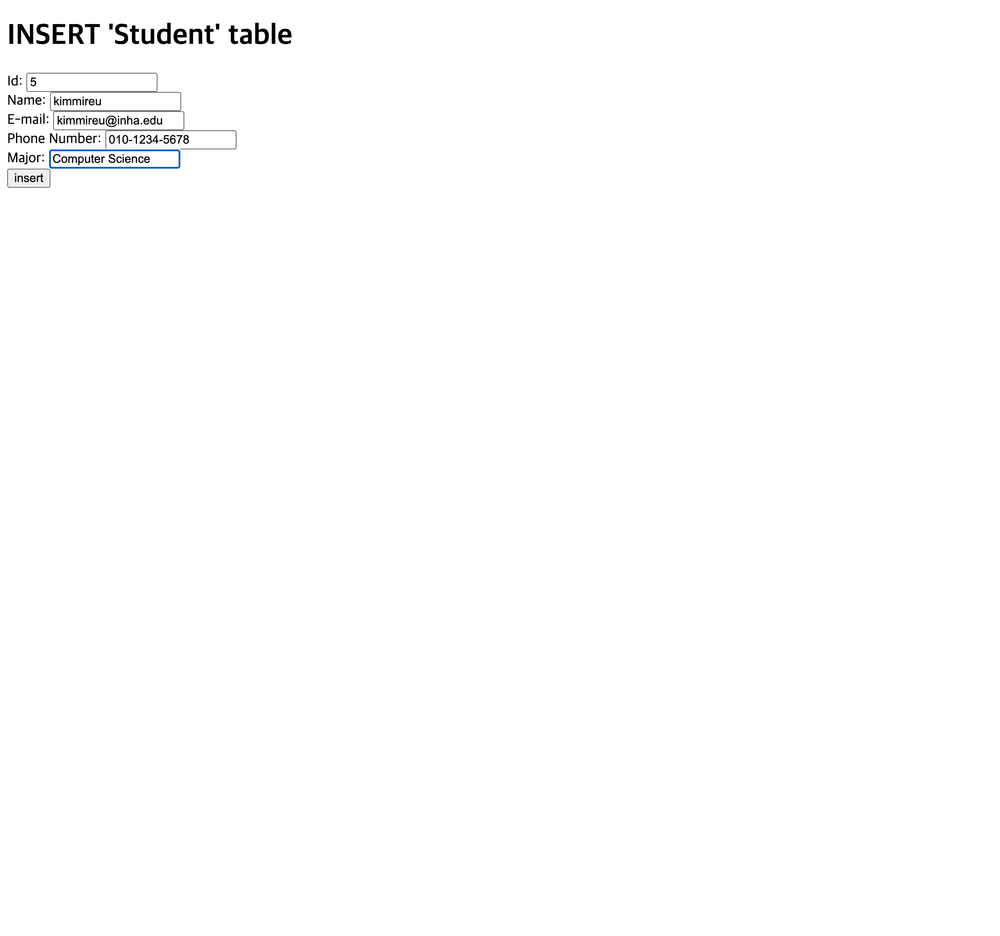
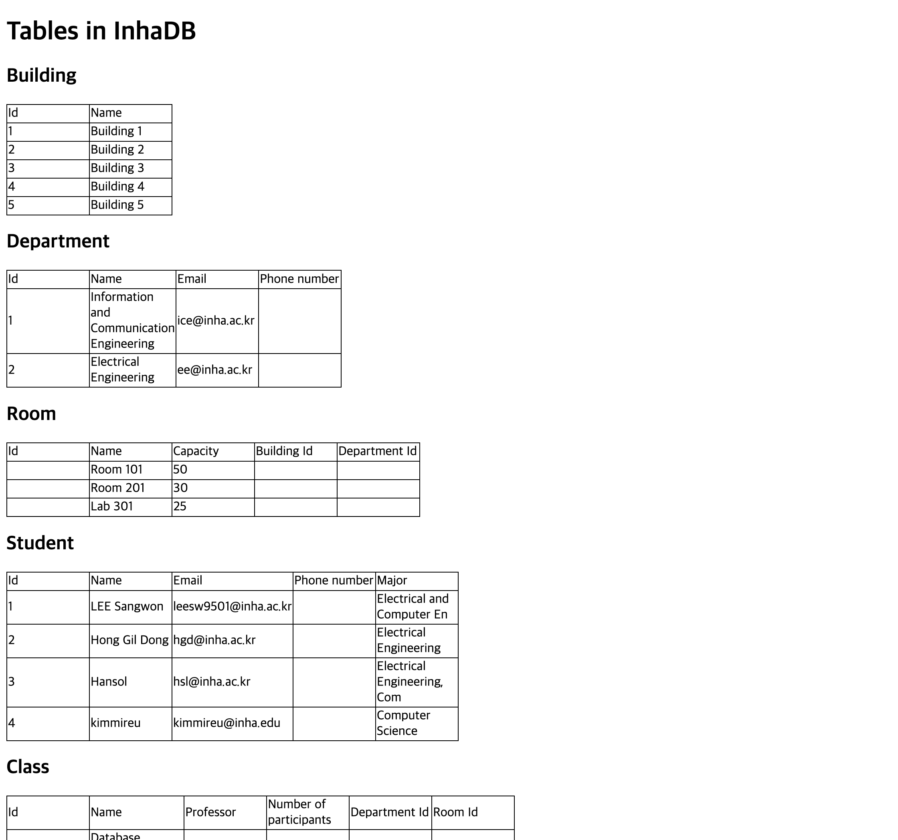
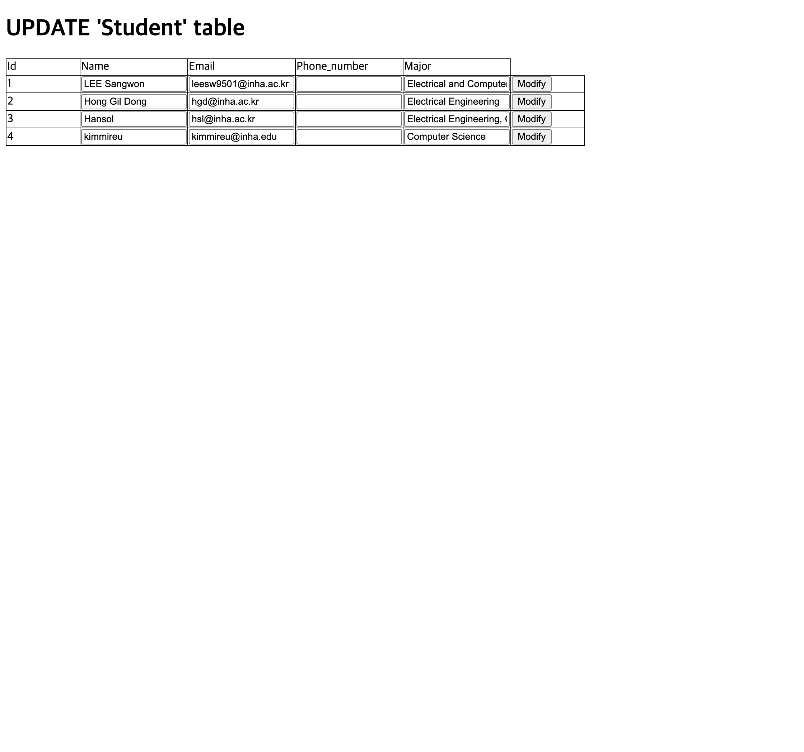

# Week 7 MySQL Express 연동 과제 보고서

## 📋 개요

### 과제 목표
이번 7주차 과제는 Node.js와 Express.js를 활용하여 MySQL 데이터베이스와 연동하는 웹 애플리케이션을 구현하는 것입니다. 주요 목표는 다음과 같습니다:

- **데이터베이스 연동**: MySQL 데이터베이스와 Node.js 애플리케이션 연결
- **데이터베이스 기능 구현**: 데이터 삽입(INSERT), 조회(SELECT), 수정(UPDATE) 기능 구현
- **웹 인터페이스**: 사용자가 쉽게 데이터를 관리할 수 있는 웹 페이지 제공
- **템플릿 엔진**: Handlebars를 활용한 동적 웹 페이지 생성

### 기술 스택
- **Backend**: Node.js, Express.js
- **Database**: MySQL 8.0
- **Template Engine**: Handlebars (hbs)
- **Database Driver**: mysql2
- **Transpiler**: Babel

### 구현 범위
1. **INSERT 기능**: Student 테이블에 새로운 학생 정보 추가
2. **SELECT 기능**: 모든 테이블(Building, Department, Room, Student, Class) 데이터 조회
3. **UPDATE 기능**: Student 및 Department 테이블 데이터 수정

---

## 🔧 상세 설계 내용

### 1. 프로젝트 구조
```
week7/
├── database/
│   └── sql.js          # 데이터베이스 연결 및 SQL 쿼리
├── routes/
│   ├── home.js         # INSERT 라우트
│   ├── select.js       # SELECT 라우트
│   └── update.js       # UPDATE 라우트
├── views/
│   ├── home.hbs        # INSERT 페이지
│   ├── select.hbs      # SELECT 페이지
│   ├── updateStudent.hbs   # Student UPDATE 페이지
│   ├── updateDepartment.hbs # Department UPDATE 페이지
│   └── layout.hbs      # 기본 레이아웃
├── src/
│   └── index.js        # Express 서버
└── screenshots/        # 실행 화면 캡처
```

### 2. 데이터베이스 설계

#### 테이블 구조
- **Building**: Id, Name
- **Department**: Id, Name, Email, Phone_number
- **Room**: Id, Name, Capacity
- **Student**: Id, Name, Email, Phone_number, Major
- **Class**: Id, Name, Professor, Number_of_participants

#### 핵심 SQL 쿼리 구현

**데이터베이스 연결 설정** (`database/sql.js`):
```javascript
const pool = mysql.createPool({
    host: 'localhost',
    port: 3306,
    user: 'root',
    password: 'c3409711',
    database: 'InhaDB',
    charset: 'utf8mb4',
    connectionLimit: 10
});
```

**SELECT 쿼리**:
```javascript
export const selectSql = {
    getBuilding: async () => {
        const sql = `select * from building`;
        const [result] = await promisePool.query(sql);
        return result;
    },
    // ... 다른 테이블 조회 함수들
};
```

**INSERT 쿼리**:
```javascript
export const insertSql = {
    setStudent: async (data) => {
        const sql = `insert into student (Id, Name, Email, Phone_number, Major) values (
            ${data.Id}, "${data.Name}", "${data.Email}", 
            "${data.PhoneNumber}", "${data.Major}"
        )`;
        await promisePool.query(sql);
    }
};
```

**UPDATE 쿼리**:
```javascript
export const updateSql = {
    updateStudent: async (data) => {
        const sql = `UPDATE Student 
            SET Id = ${data.Id}, Name = "${data.Name}", 
                Email = "${data.Email}", PhoneNumber = "${data.PhoneNumber}",
                Major = "${data.Major}"
            WHERE Id = ${data.Id}`;
        await promisePool.query(sql);
    }
};
```

### 3. 라우팅 구조

#### Express 서버 설정 (`src/index.js`):
```javascript
import express from 'express';
import homeRouter from '../routes/home';
import selectRouter from '../routes/select';
import updateRouter from '../routes/update';

const app = express();
app.set('view engine', 'hbs');
app.use('/', homeRouter);
app.use('/select', selectRouter);
app.use('/update', updateRouter);
```

#### 라우트별 기능
- **GET /**: INSERT 페이지 렌더링
- **POST /**: Student 데이터 삽입 처리
- **GET /select**: 모든 테이블 데이터 조회 및 표시
- **GET /update/student**: Student 수정 페이지
- **POST /update/student**: Student 데이터 수정 처리
- **GET /update/department**: Department 수정 페이지
- **POST /update/department**: Department 데이터 수정 처리

### 4. 구현 방식과 사고 과정

#### 설계 접근 방법
1. **요구사항 분석**: PDF에서 명시된 기능들을 정확히 파악
2. **데이터베이스 설계**: 5개 테이블 구조를 PDF 예시에 맞게 설계
3. **라우팅 설계**: RESTful API 원칙에 따라 URL 구조 설계
4. **템플릿 설계**: Handlebars를 활용한 동적 페이지 구성

#### 핵심 구현 포인트
- **Connection Pool**: 데이터베이스 연결 효율성 향상
- **Async/Await**: 비동기 처리로 성능 최적화
- **템플릿 엔진**: 동적 데이터 바인딩으로 유연한 UI 제공
- **에러 처리**: 데이터베이스 연결 및 쿼리 실행 시 안정성 확보

---

## 📸 실행 화면

### 1. INSERT 페이지 - 학생 데이터 입력


**설명**: Student 테이블에 새로운 학생 정보를 입력하는 페이지입니다. Id, Name, E-mail, Phone Number, Major 필드를 통해 데이터를 입력할 수 있습니다. 위 화면에서는 "kimmireu"라는 학생 정보를 입력하는 과정을 보여줍니다.

### 2. SELECT 페이지 - 모든 테이블 데이터 조회


**설명**: 데이터베이스의 모든 테이블(Building, Department, Room, Student, Class) 데이터를 조회하여 표시하는 페이지입니다. 각 테이블별로 데이터가 테이블 형태로 깔끔하게 정리되어 표시됩니다. Student 테이블에서 방금 입력한 "kimmireu" 데이터가 4번째 행에 정상적으로 표시되는 것을 확인할 수 있습니다.

### 3. UPDATE 페이지 - 학생 데이터 수정


**설명**: Student 테이블의 기존 데이터를 수정할 수 있는 페이지입니다. 각 행의 데이터가 입력 필드로 표시되어 직접 수정이 가능하며, "Modify" 버튼을 통해 변경사항을 저장할 수 있습니다. "kimmireu" 학생의 정보도 수정 가능한 상태로 표시됩니다.

---

## 🎯 결론

### 구현 성공 사항
1. **완전한 데이터베이스 기능**: INSERT, SELECT, UPDATE 기능이 모두 정상적으로 구현되었습니다.
2. **데이터베이스 연동**: MySQL과 Node.js 애플리케이션이 안정적으로 연결되어 데이터 처리가 원활합니다.
3. **사용자 친화적 인터페이스**: 직관적인 웹 인터페이스를 통해 데이터베이스 조작이 가능합니다.
4. **확장 가능한 구조**: 모듈화된 코드 구조로 향후 기능 추가가 용이합니다.

### 기술적 성과
- **비동기 처리**: async/await 패턴을 활용한 효율적인 데이터베이스 처리
- **템플릿 엔진 활용**: Handlebars를 통한 동적 웹 페이지 생성
- **RESTful 설계**: 직관적이고 일관성 있는 URL 구조 설계
- **에러 처리**: 안정적인 애플리케이션 운영을 위한 예외 처리

### 학습 효과
이번 과제를 통해 Node.js와 Express.js를 활용한 웹 애플리케이션 개발, MySQL 데이터베이스 연동, 템플릿 엔진 사용법 등 웹 개발의 핵심 기술들을 실습할 수 있었습니다. 특히 데이터베이스와 웹 애플리케이션 간의 연동 과정을 직접 구현해보면서 백엔드 개발의 전반적인 흐름을 이해할 수 있었습니다.

### 향후 개선 방향
- **유효성 검사**: 입력 데이터 검증 로직 추가
- **보안 강화**: SQL Injection 방지 및 인증 시스템 구현
- **UI/UX 개선**: 더 직관적이고 현대적인 사용자 인터페이스 개발

---

**보고서 작성 서약서**

나는 보고서 작성시 윤리에 어긋난 행동을 하지 않고 정보통신공학인으로서 나의 명예를 지킬 것을 맹세합니다.

- 다른 학생의 보고서를 베끼거나 여러 보고서의 내용을 짜집기하지 않겠습니다.
- 보고서의 주요 내용을 인터넷사이트 등을 통해 얻지 않겠습니다.
- 보고서의 내용을 조작하지 않겠습니다.
- 보고서 작성에 참고한 문헌의 출처를 밝히겠습니다.
- 보고서를 제출 전에 타학생에게 보여주지 않겠습니다.

**학번**: [학번 입력]  
**이름**: kimmireu  
**제출일**: 2024년 10월 27일
